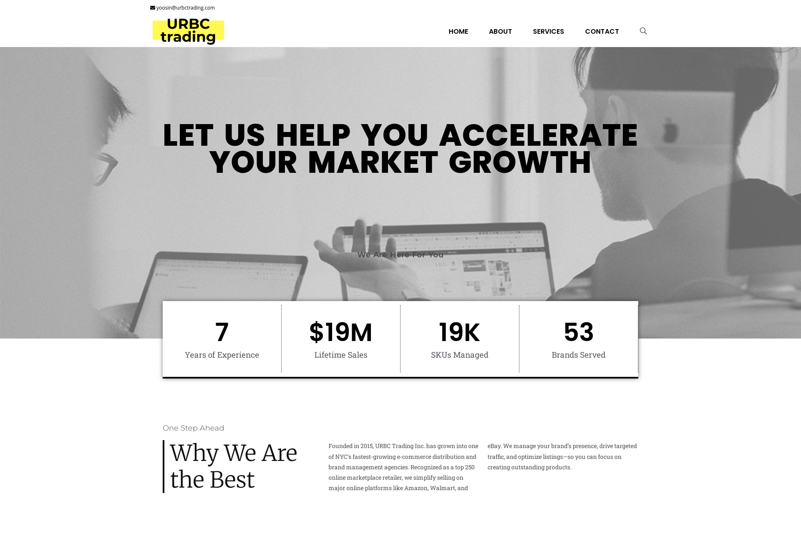

# URBC Trading - Corporate Website

This repository contains a backup of the corporate website for **URBC Trading** ([urbctrading.com](https://urbctrading.com)), a business-focused WordPress site showcasing the company’s services, mission, and contact information.

## 🔧 Tech Stack
- WordPress CMS
- Custom theme and plugin integration
- HTML5, CSS3, PHP
- Responsive design using media queries

## 📌 Features
- Clean, modern corporate design
- Service introduction and contact page
- Mobile-friendly layout
- Optimized performance and SEO-ready structure

## 📂 Structure
This repository includes:
- `/wp-content/themes/` – Custom theme used in the website
- `/wp-content/plugins/` – Plugins used (non-premium only)
- Backup ZIP of site files (without sensitive data)

> ⚠️ Note: Database and sensitive config files (e.g., `wp-config.php`) are excluded for security reasons.

## 🎯 Purpose
This is a portfolio project to demonstrate experience in building and customizing WordPress-based corporate websites.
